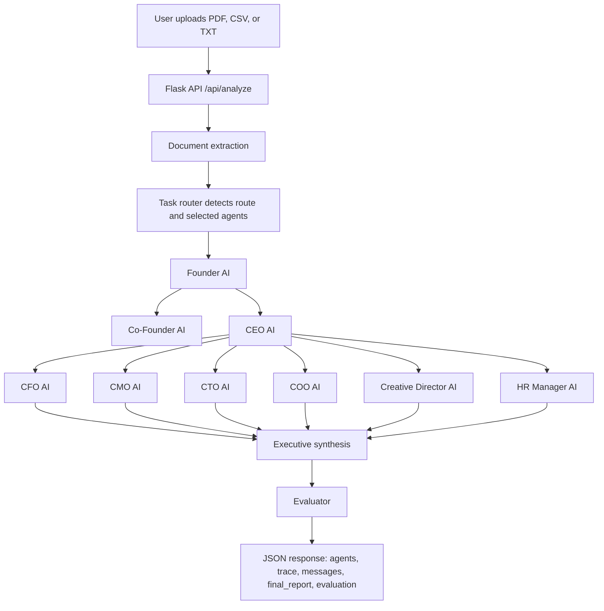

# FinFlow AI Corporation

Prototype multi-agent finance operations system built for the AI Generalist Hackathon.

FinFlow AI Corporation turns a financial document into a coordinated executive report by routing the same source data through a simulated company of AI agents: Founder, Co-Founder, CEO, department heads, and worker agents. The project is positioned as an agentic finance-ops prototype: part document intelligence, part organizational workflow simulation, part recruiter-friendly demonstration of prompt orchestration.

## Why This Project Matters

Finance operations often depend on manual review, spreadsheet cleanup, delayed reporting, and fragmented decision-making. FinFlow explores how a multi-agent system can compress that workflow into a single autonomous run:

1. A user uploads a PDF, CSV, or TXT financial document.
2. The backend extracts structured text from the file.
3. A hierarchy of Groq-powered agents analyzes the same context from different operating roles.
4. The frontend displays a company-style intelligence report across strategy, finance, operations, technology, marketing, creative, and HR perspectives.

## System Architecture

```text
User Upload
   |
   v
Flask API (/api/analyze)
   |
   v
Document Extraction
   |
   v
Task Router
   |
   v
Founder AI -> Co-Founder AI -> CEO AI
   |
   v
Department Agents: CFO, CMO, CTO, COO, Creative, HR
   |
   v
JSON response -> Browser report tabs -> Downloadable report
```



## Runtime Task Routing

FinFlow now detects the uploaded document type at runtime with `services/task_router.py`. The router uses lightweight keyword rules and `task_routing.yaml` metadata to choose a task type, priority, selected agents, reason, and confidence score.

The default UI still runs `full_analysis=true`, which executes all 9 agents for the cinematic demo. API users can send `full_analysis=false` to run only the routed department agents while always preserving the Founder, Co-Founder, and CEO strategic flow.

| Task Type | Trigger Examples | Routed Department Focus |
| --- | --- | --- |
| `invoice_analysis` | invoice, payment, due, vendor, bill | CFO + COO |
| `revenue_analysis` | revenue, income, sales, client payment | CFO + CEO |
| `expense_review` | expense, cost, spend, subscription | CFO + COO |
| `risk_assessment` | risk, anomaly, fraud, late, overdue | CFO + CEO + COO |
| `market_summary` | marketing, ad, campaign, SEO, social | CMO + CEO |
| `technical_audit` | server, API, security, backend, frontend | CTO + COO |
| `operations_review` | workflow, process, operations, productivity | COO + CEO |
| `content_generation` | design, brand, content, creative | Creative + CMO |
| `general_finance_review` | fallback route | Founder + Co-Founder + CEO + CFO + COO |

## Agent Trace Logging

Every agent call is wrapped by `services/trace_logger.py`. The trace records:

- `agent_name`
- `role`
- `status`
- `started_at`
- `ended_at`
- `duration_ms`
- `output_preview`
- `error`

The API response includes a `trace` array so reviewers can inspect execution order, timing, and failures without reading server logs.

## Agent-to-Agent Message Schema

`services/schemas.py` defines an `AgentMessage` dataclass for explicit handoffs between roles:

```python
AgentMessage(
    sender="Founder AI",
    receiver="CEO AI",
    task="delegate_department_work",
    priority="high",
    context="Founder directives and company data",
    expected_output="Department delegations, KPI dashboard, and operating plan",
    confidence=0.9,
)
```

The current runtime returns these handoffs in the `messages` field. This keeps the project honest: the schema is implemented and visible, while deeper dynamic routing remains a next-step improvement.

## Evaluator And Synthesis

`agents/synthesis.py` creates a single `final_report` from the 9 agent outputs. The report includes:

- Executive summary
- Financial snapshot
- Risks
- Opportunities
- Recommended actions
- Disclaimer that the output is not financial advice

`agents/evaluator.py` runs a simple rule-based quality check over the agent outputs. It returns:

- `score` from 0 to 100
- `passed`
- `missing_sections`
- `recommendations`

The evaluator checks for financial summary, risk assessment, actionable recommendations, operational observations, caution/disclaimer language, and all 9 required agent outputs.

## Agent Hierarchy

| Tier | Agent | File | Responsibility |
| --- | --- | --- | --- |
| Strategy | Founder AI | `agents/founder.py` | Strategic vision, key decisions, risk assessment |
| Strategy | Co-Founder AI | `agents/cofounder.py` | Scaling, optimization, cross-department coordination |
| Orchestration | CEO AI | `agents/ceo.py` | Delegation, KPI tracking, operational directives |
| Department | CFO AI | `agents/cfo.py` | Budget, revenue, expenses, forecasts, financial health |
| Department | CMO AI | `agents/cmo.py` | Market insights, campaign strategy, growth metrics |
| Department | CTO AI | `agents/cto.py` | Architecture, AI workflow status, security review |
| Department | COO AI | `agents/coo.py` | Workflow health, automation, bottlenecks |
| Department | Creative AI | `agents/creative.py` | Brand, UI/UX, content production |
| Department | HR AI | `agents/hr.py` | Resource allocation, training, team performance |
| Worker Pipeline | Analyst, Reporter, Advisor | `agents/analyst.py`, `agents/reporter.py`, `agents/advisor.py` | Extraction, reporting, recommendations |

## Tech Stack

| Layer | Technology |
| --- | --- |
| Backend API | Python, Flask, Flask-CORS |
| AI Runtime | Groq API with LLaMA 3.3 70B |
| Document Processing | `pandas`, `pdfplumber` |
| Frontend Demo | Vanilla HTML/CSS/JavaScript |
| Alternate UI | Streamlit prototype in `app.py` |
| Config | `.env`, `agent_configs.json`, `task_routing.yaml` |

## Repository Structure

```text
finflow-ai/
├── server.py              # Main Flask API used by index.html
├── config.py              # Environment-driven runtime settings
├── index.html             # Browser demo and agent report UI
├── corporation.py         # 9-agent company execution flow
├── orchestrator.py        # 3-agent worker pipeline used by Streamlit app
├── app.py                 # Alternate Streamlit prototype
├── agents/                # Role-specific agent prompts and functions
├── samples/               # Fake sample CSV/TXT files for local demos
├── services/              # Trace logger and agent message schemas
├── tests/                 # API and orchestration tests
├── utils/helpers.py       # Groq client wrapper and environment loading
├── agent_configs.json     # Agent metadata and routing configuration
├── task_routing.yaml      # Task routing rules for future orchestration
├── requirements.txt       # Python dependencies
└── .env.example           # Environment variable template
```

## Setup

### 1. Clone and enter the project

```bash
git clone https://github.com/MrithunjoyB/finflow-ai.git
cd finflow-ai
```

### 2. Create a virtual environment

```bash
python3 -m venv .venv
source .venv/bin/activate
```

On Windows PowerShell:

```powershell
python -m venv .venv
.\.venv\Scripts\Activate.ps1
```

### 3. Install dependencies

```bash
pip install -r requirements.txt
```

### 4. Configure environment

```bash
cp .env.example .env
```

The default `.env.example` runs in recruiter-friendly demo mode:

```text
DEMO_MODE=true
PORT=5050
GROQ_API_KEY=your_groq_api_key_here
```

In `DEMO_MODE=true`, the app returns polished mock agent outputs and does not call Groq. This lets reviewers run the full 9-agent UI without creating an API key.

For live LLM responses, edit `.env`:

```text
DEMO_MODE=false
GROQ_API_KEY=your_real_groq_api_key
```

Do not commit `.env`. It is intentionally ignored by `.gitignore`.

## Run The Main Demo

Start the Flask backend:

```bash
python3 server.py
```

Open `index.html` in a browser, then upload a PDF, CSV, or TXT file. The frontend sends the file to:

```text
http://localhost:5050/api/analyze
```

Health check:

```bash
curl http://localhost:5050/api/health
```

Expected response:

```json
{"allowed_extensions":["csv","pdf","txt"],"demo_mode":true,"status":"AI Corporation Online"}
```

Backward-compatible routes are still available:

```text
/health
/analyze
```

Optional routed mode for API testing:

```bash
curl -X POST \
  -F "full_analysis=false" \
  -F "file=@samples/sample_invoice.txt" \
  http://localhost:5050/api/analyze
```

Use `full_analysis=true` for the complete 9-agent demo. Use `full_analysis=false` to demonstrate task-routed execution.

The `/api/analyze` response includes:

```json
{
  "success": true,
  "run_id": "abc123",
  "full_analysis": true,
  "routing": {
    "task_type": "invoice_analysis",
    "priority": "high",
    "selected_agents": ["founder", "cofounder", "ceo", "cfo", "coo"],
    "reason": "Detected invoice/payment/amount keywords",
    "confidence": 0.82
  },
  "agents": {
    "founder": "...",
    "cofounder": "...",
    "ceo": "...",
    "cfo": "...",
    "cmo": "...",
    "cto": "...",
    "coo": "...",
    "creative": "...",
    "hr": "..."
  },
  "trace": [
    {
      "agent_name": "Founder AI",
      "role": "Strategic vision and master oversight",
      "status": "completed",
      "started_at": "2026-07-03T00:00:00+00:00",
      "ended_at": "2026-07-03T00:00:01+00:00",
      "duration_ms": 1000,
      "output_preview": "...",
      "error": null
    }
  ],
  "evaluation": {
    "score": 100,
    "passed": true,
    "missing_sections": [],
    "recommendations": []
  },
  "final_report": "...",
  "founder": "...",
  "cofounder": "...",
  "ceo": "...",
  "cfo": "...",
  "cmo": "...",
  "cto": "...",
  "coo": "...",
  "creative": "...",
  "hr": "..."
}
```

The individual top-level agent keys are preserved so the existing cinematic frontend continues to work.

## Sample Files

Fake sample files are included for quick recruiter demos:

- `samples/sample_transactions.csv` for revenue analysis
- `samples/sample_invoice.txt` for invoice analysis
- `samples/sample_expenses.csv` for expense review

These files contain synthetic data only.

## Run Tests

```bash
pytest
```

The tests cover routing classification, API compatibility, demo-mode routed execution, trace logging, synthesis, and evaluator behavior.

## Optional Streamlit Prototype

The Streamlit app runs a smaller worker-agent pipeline with Analyst, Reporter, and Advisor agents:

```bash
streamlit run app.py
```

Use this path when you want a simpler document-intelligence demo. Use `server.py` + `index.html` when showing the full FinFlow AI Corporation hierarchy.

## Security Notes

- `.env` and `*.env` files are ignored.
- Uploaded financial files are stored under `data/<run_id>/`, which is ignored.
- The API key is loaded from `GROQ_API_KEY` and is never hard-coded.
- The Flask upload endpoint validates file extensions, sanitizes filenames, applies `MAX_CONTENT_LENGTH`, and returns a unique `run_id`.
- `DEMO_MODE=true` allows safe public demos without exposing or requiring API keys.

## Current Limitations

- Agent execution is sequential today; parallel department execution would reduce latency.
- Runtime routing is rule-based today; it does not yet use an LLM planner or learned classifier.
- The agents currently use a lightweight message schema rather than a full planner/router loop.
- Test coverage is intentionally lightweight and focused on routing, API behavior, demo mode, tracing, and evaluator output.

## Strong Next Improvements For An Agentic AI Internship

- Add a real `Message` schema for agent-to-agent communication with fields like `sender`, `receiver`, `task`, `priority`, `confidence`, and `evidence`.
- Execute department agents concurrently with `asyncio` or a worker queue, then have the CEO synthesize their outputs.
- Use `task_routing.yaml` more deeply for configurable route policies and confidence thresholds.
- Add a richer evaluation harness with expected outputs for each sample document.
- Add structured JSON outputs from each agent before rendering human-readable reports.
- Expand trace logs into a full agent decision timeline with prompt IDs and confidence updates.
- Expand demo mode with role-specific sample reports and trace logs.

## Recruiter Snapshot

FinFlow AI Corporation demonstrates:

- Multi-agent prompt architecture and role design
- LLM API integration with environment-based secret management
- Financial document ingestion using PDF and CSV tooling
- Flask API design for AI workflows
- Frontend presentation of asynchronous agent results
- Product thinking around autonomous business operations

Built by Mrithunjoy Basumatary as a hackathon project and portfolio piece for AI systems, agentic AI, and automation-focused internship roles.
