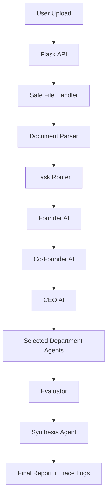

# FinFlow AI Corporation

## Overview

FinFlow AI Corporation is a task-routed multi-agent finance operations prototype. It accepts financial documents, detects the task type, routes work to relevant AI agents, logs execution traces, evaluates output completeness, and synthesizes a final CFO-style report.

The project is designed for public portfolio review, internship applications, hackathon judging, and startup-style evaluation. It is not a production finance platform yet, but it demonstrates the core architecture behind a traceable agentic AI workflow.

## Problem

Small businesses, freelancers, student startups, and small finance teams spend hours manually reading invoices, CSV exports, expenses, and finance reports. These workflows often involve repeated document review, manual categorization, spreadsheet checking, and delayed decision-making.

## Solution

FinFlow compresses that workflow into a guided multi-agent pipeline:

Upload PDF/CSV/TXT -> FinFlow parses content -> task router detects workflow -> selected AI agents analyze -> evaluator checks quality -> synthesis agent generates final report.

The system keeps the 9-agent AI corporation concept while adding runtime routing, trace logging, demo mode, and a clearer API contract.

## Key Features

- PDF, CSV, and TXT financial document upload
- Demo mode without a Groq API key
- 9-agent AI corporation architecture
- Runtime task routing
- Agent trace logging
- Evaluator agent for output completeness
- Synthesis/final report agent
- Premium React/Vite command-center frontend
- Fake sample files for safe demos
- Pytest coverage for routing, API behavior, tracing, and evaluator checks

## Architecture



## AI Agent Architecture

Leadership agents:

- Founder AI
- Co-Founder AI
- CEO AI

Department agents:

- CFO AI
- CMO AI
- CTO AI
- COO AI
- Creative Director AI
- HR Manager AI

Worker and legacy agents:

- Analyst
- Reporter
- Advisor

The leadership agents always run first in routed mode so the system keeps the strategic company hierarchy. Department agents are selected by task type unless `full_analysis=true` is used.

## Runtime Task Routing

| Task Type | Trigger Keywords | Selected Agents | Purpose |
| --- | --- | --- | --- |
| `invoice_analysis` | invoice, payment, due, vendor, bill | Founder, Co-Founder, CEO, CFO, COO | Review invoices, vendor bills, due dates, totals, and payment status. |
| `revenue_analysis` | revenue, income, sales, client payment | Founder, Co-Founder, CEO, CFO | Analyze revenue, income, sales, and client payment signals. |
| `expense_review` | expense, cost, spend, subscription | Founder, Co-Founder, CEO, CFO, COO | Review vendor spend, subscriptions, recurring costs, and cost-control opportunities. |
| `risk_assessment` | risk, anomaly, fraud, late, overdue | Founder, Co-Founder, CEO, CFO, COO | Identify finance and operations risks. |
| `market_summary` | marketing, ad, campaign, seo, social | Founder, Co-Founder, CEO, CMO | Summarize marketing and growth signals. |
| `technical_audit` | server, api, security, backend, frontend | Founder, Co-Founder, CEO, CTO, COO | Review technical and security-related signals. |
| `operations_review` | workflow, process, operations, productivity | Founder, Co-Founder, CEO, COO | Review process, productivity, and operational bottlenecks. |
| `content_generation` | design, brand, content, creative | Founder, Co-Founder, CEO, Creative, CMO | Review or generate brand/content direction. |
| `general_finance_review` | fallback route | Founder, Co-Founder, CEO, CFO, COO | General finance review when no specialized route matches. |

## Demo Mode

`DEMO_MODE=true` allows the project to run without a Groq API key. This is useful for recruiters, judges, and reviewers who want to test the interface and API quickly.

Live LLM mode requires:

```text
DEMO_MODE=false
GROQ_API_KEY=your_real_groq_api_key
```

## Setup Instructions

Backend:

```bash
python3 -m venv .venv
source .venv/bin/activate
python3 -m pip install -r requirements.txt
cp .env.example .env
python3 server.py
```

Open the health endpoint:

```text
http://127.0.0.1:5050/api/health
```

Frontend:

```bash
cd frontend
npm install
npm run dev
```

Open the React frontend:

```text
http://localhost:5173
```

The backend must be running on port `5050` because the frontend API layer points to `http://127.0.0.1:5050`.

The previous vanilla HTML experience is preserved at `legacy/index.html`.

## Frontend Stack

- Vite
- React
- TypeScript
- Tailwind CSS
- Framer Motion
- Lucide React

The frontend is located in `frontend/` and is designed as an AI finance mission-control surface. It keeps the same backend API contract while improving the visual hierarchy, upload experience, routing display, final report readability, evaluator view, and trace timeline.

## API Endpoints

| Method | Endpoint | Purpose |
| --- | --- | --- |
| GET | `/api/health` | Current health endpoint |
| GET | `/health` | Backward-compatible health endpoint |
| POST | `/api/analyze` | Current analysis endpoint |
| POST | `/analyze` | Backward-compatible analysis endpoint |

Example:

```bash
curl -X POST http://127.0.0.1:5050/api/analyze \
  -F "file=@samples/sample_invoice.txt" \
  -F "full_analysis=false"
```

Use `full_analysis=true` for the complete 9-agent demo. Use `full_analysis=false` for routed execution.

## API Response Example

```json
{
  "success": true,
  "run_id": "example-run-id",
  "routing": {
    "task_type": "invoice_analysis",
    "priority": "high",
    "selected_agents": ["founder", "cofounder", "ceo", "cfo", "coo"],
    "reason": "Detected invoice/payment/amount keywords",
    "confidence": 0.82
  },
  "agents": {
    "founder": "...",
    "cofounder": "...",
    "ceo": "...",
    "cfo": "...",
    "cmo": "...",
    "cto": "...",
    "coo": "...",
    "creative": "...",
    "hr": "..."
  },
  "trace": [
    {
      "agent_name": "Founder AI",
      "role": "Strategic vision and master oversight",
      "status": "completed",
      "started_at": "2026-07-04T00:00:00+00:00",
      "ended_at": "2026-07-04T00:00:01+00:00",
      "duration_ms": 1000,
      "output_preview": "...",
      "error": null
    }
  ],
  "evaluation": {
    "score": 100,
    "passed": true,
    "missing_sections": [],
    "recommendations": []
  },
  "final_report": "..."
}
```

Backward-compatible top-level agent keys are also returned: `founder`, `cofounder`, `ceo`, `cfo`, `cmo`, `cto`, `coo`, `creative`, and `hr`.

## Sample Files

- `samples/sample_transactions.csv`
- `samples/sample_invoice.txt`
- `samples/sample_expenses.csv`

These files use fake data only and are safe for demos.

## Testing

```bash
python3 -m pytest
```

Tests cover task routing, demo-mode API behavior, trace logging, evaluator output, and backward-compatible endpoints.

Frontend build check:

```bash
cd frontend
npm run build
```

## Security Notes

- `.env` is gitignored.
- `data/` and `outputs/` are gitignored.
- Do not upload real financial documents in a public demo.
- Demo mode avoids exposing API keys.
- File uploads are restricted to PDF, CSV, and TXT.
- This is not production financial advice.

## Current Limitations

- No database yet
- No user authentication yet
- No encrypted file storage yet
- Routing is rule-based
- Demo mode uses mock AI outputs
- Financial outputs are informational, not financial, tax, legal, or investment advice

## Roadmap

- Real-time trace UI
- Stronger evaluator
- Financial metric calculator
- Anomaly detection
- Cash-flow forecasting
- PDF report export
- RAG knowledge base
- QuickBooks/Xero integrations
- Secure user accounts
- Deployment

## Portfolio Summary

FinFlow AI Corporation is an internship/hackathon-ready prototype for agentic finance operations. It demonstrates task routing, multi-agent orchestration, traceable execution, evaluator checks, synthesis reporting, and safe demo-mode operation.
