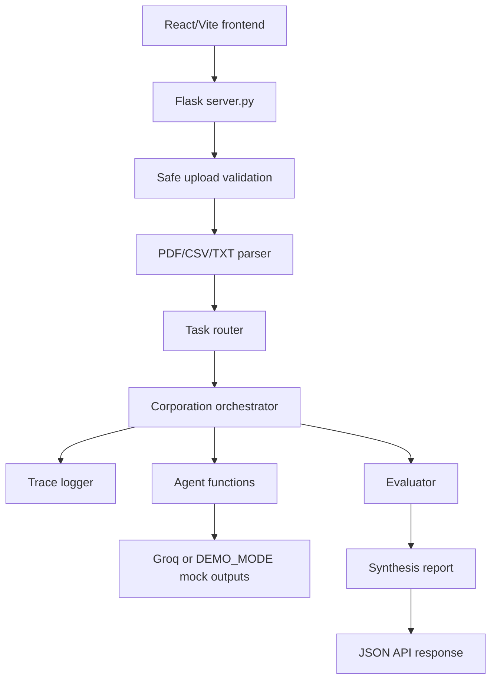
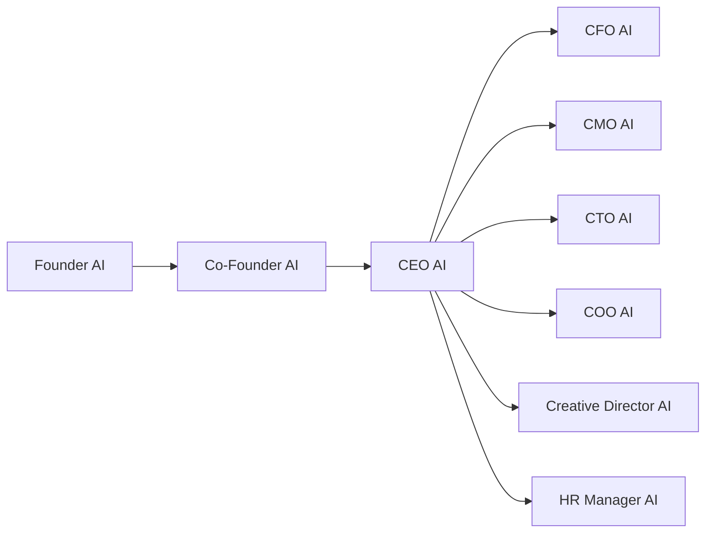
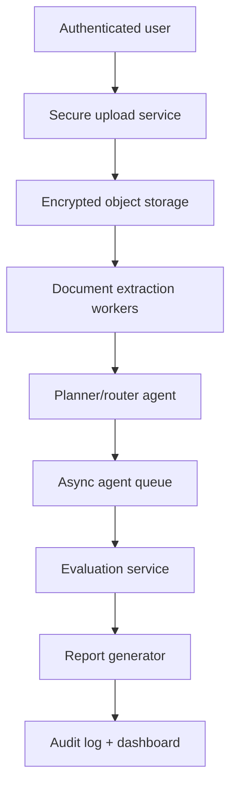

# FinFlow AI Architecture

## Current Architecture

FinFlow AI Corporation is a Flask-based multi-agent finance operations prototype with a premium React/Vite command-center frontend. The backend accepts financial documents, extracts text, detects the task type, runs a 9-agent AI corporation workflow, traces execution, evaluates output completeness, and synthesizes a final report.

## Backend Flow

1. `server.py` receives `/api/analyze` or `/analyze`.
2. The file is validated against allowed extensions: PDF, CSV, TXT.
3. The file is saved under `data/<run_id>/`.
4. Text is extracted with `pdfplumber`, `pandas`, or TXT reading.
5. `services/task_router.py` detects the task type.
6. `corporation.py` runs either the full 9-agent analysis or routed mode.
7. `services/trace_logger.py` records every executed agent call.
8. `agents/evaluator.py` checks output completeness.
9. `agents/synthesis.py` creates the final report.
10. The API returns `run_id`, `routing`, `agents`, `trace`, `evaluation`, and `final_report`.

## Frontend Flow

The primary frontend lives in `frontend/` and uses React, TypeScript, Vite, Tailwind CSS, Framer Motion, and Lucide React. It uploads a document to `/api/analyze`, displays the original department tab outputs, and also displays:

- Detected task routing
- Final executive report
- Agent trace timeline

The previous vanilla HTML interface is preserved in `legacy/index.html`.

The UI still depends on backward-compatible top-level agent keys such as `founder`, `ceo`, and `cfo`.

## Agent Workflow

Leadership agents always run first. Department agents run based on `full_analysis`:

- `full_analysis=true`: run all 9 agents.
- `full_analysis=false`: run Founder, Co-Founder, CEO, and selected routed department agents.

## Task Routing

Routing is rule-based and uses keyword matches for workflows such as invoice analysis, revenue analysis, expense review, risk assessment, market summary, technical audit, operations review, content generation, and general finance review.

`task_routing.yaml` stores route metadata such as route owner, supporting agents, workers, priority, output format, and description.

## Trace Logging

Each executed agent call returns:

- `agent_name`
- `role`
- `status`
- `started_at`
- `ended_at`
- `duration_ms`
- `output_preview`
- `error`

This makes the system easier to debug and easier for reviewers to evaluate.

## Evaluator And Synthesis

The evaluator is intentionally rule-based. It checks whether outputs include financial summary, risk assessment, actionable recommendations, operational observations, disclaimer/caution, and agent completeness.

The synthesis agent combines outputs into one final report with executive summary, financial snapshot, risks, opportunities, recommended actions, and disclaimer.

## Demo Mode vs Live LLM Mode

Demo mode:

- `DEMO_MODE=true`
- Does not require a Groq API key
- Returns polished mock agent outputs
- Best for recruiters and judges

Live mode:

- `DEMO_MODE=false`
- Requires `GROQ_API_KEY`
- Calls Groq/LLaMA through `utils/helpers.py`

## Future Production Architecture

Future production work should include encrypted file storage, authentication, async job queues, stronger evaluation, persistent audit logs, and finance-system integrations.
